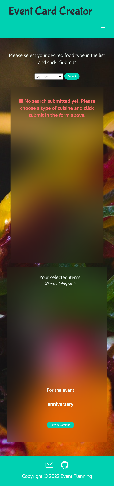
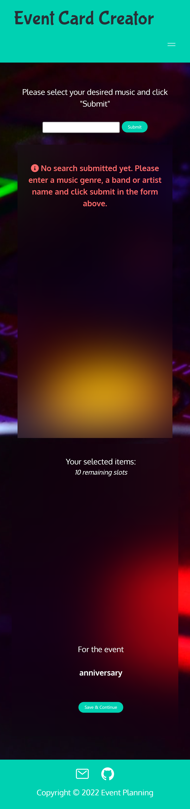
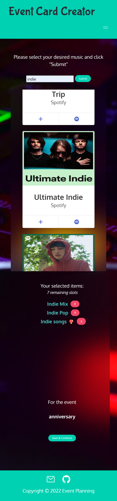

# Event-planning website

## Summary of the project

Event Card creator - this project takes you through steps to create your event card. The user goes through a form where they can enter the event details, a food selection and a music selection, and all their information is then rendered on an event card template that they can print.
The created events are saved in local storage and the user can consult and edit them by going on the "My Saved Events" page.

## Links to the project

Deployed URL: [https://am0031.github.io/event-planning/](https://am0031.github.io/event-planning/)

Github repository: [https://github.com/Am0031/event-planning](https://github.com/Am0031/event-planning)

## User Story

## Wireframes

Wireframe - Start page 

Wireframe - Form page 

Wireframe - Food/Selection page 

Wireframe - Event Card page 

Wireframe - Saved Events page 

## Screenshots of the project

Desktop viewport:

Desktop - Start page 

Desktop - Event details form 

Desktop - Food selection - Empty page before first search 

Desktop - Food selection - Search and Selection ongoing 

Desktop - Music selection - Empty page before first search 

Desktop - Music selection - Search and Selection ongoing 

Desktop - Event card 

Mobile viewport:

Mobile - Start page 

Mobile - Event details form 

Mobile - Food selection - Empty page before first search 

Mobile - Food selection - Search and Selection ongoing 

Mobile - Music selection - Empty page before first search 

Mobile - Music selection - Search and Selection ongoing 

Mobile - Event card 

## Logic of the pages - Block diagram

## Future developments

Future improvement:

- trigger search on select change and remove submit button
- up the limit of items received from API
- add more editing options
