# Event-planning website 


## Project Summary

Event Card creator - this project takes the user through steps to create their event card. The user enters information about their event details on a form, selects their chosen food and music and all their information is then rendered on an event card template that they can print.

The created events are saved in local storage and the user can consult and edit them by going on the "My Saved Events" page.

## Table of content
- [Links to the project](#links-to-the-project)
- [Team members](#team-members)
- [Technologies](#technologies)
- [User Story](#user-story)
- [Detailed User Journey](#detailed-user-journey)
- [Wireframes](#wireframes)
- [Screenshots of the project](#screenshots-of-the-project)
- [Future developments](#future-developments)
- [Contact me](#contact-me)

## Links to the project

[Deployed URL](https://nsharma-uk.github.io/event-planning/)

[Github repository](https://github.com/nsharma-uk/event-planning)

[Google slides here](https://docs.google.com/presentation/d/1wkRouc3eq4xP9rb7HRLQD0yUcFa2kGUbxFEFFGGqE4E/edit#slide=id.g29f43f0a72_0_0)


## Team members

[Smeea Arshad](https://github.com/smeea-2018)

[Gurmanpreet Nagra](https://github.com/Mkn01)

[Amelie Pira](https://github.com/Am0031)

[Abu Saddique](https://github.com/abusaddique95)

[Aisha Saleh](https://github.com/Saleha22)

[Nayan Sharma](https://github.com/nsharma-uk)


## User Story

AS A user
I WANT to create an event card by gathering the details of the event, creating a menu and a music playlist and see my bespoke event card
SO THAT I can print it to share/email it with my guest list.

## Detailed User Journey

```
GIVEN I am a user who wants to create an event card
WHEN I land on the webpage
THEN I see a start page with a start button

WHEN I click on the start button
THEN I am presented with a form where I can enter my event details

WHEN I click on the form's save button
THEN my details are saved and I am presented with the page for food selection

WHEN I choose from the dropdown menu and click on the food submit button
THEN I am presented with a variety of recipe cards matching my chosen criteria

WHEN I click on the add button a recipe card
THEN I can see it being added to my selection list

IF I want to discard any or all of cards on my menu
THEN I can delete them by clicking on the x sign

WHEN I click on Save and Continue
THEN my food selection is saved and I am presented with the page for music selection

WHEN I input my chosen genre, track or artist and I click on the music submit button
THEN I am presented with a variety of playlist cards matching my chosen criteria

WHEN I click the add button on a playlist card
THEN I can see it being added to my selection list

IF I want to discard any or all of cards on my playlist
THEN I can delete them by clicking on the x sign

WHEN I click on Save and Continue
THEN my music selection is saved and I am presented with the bespoke event card

WHEN I click on the print button
THEN I can print my bespoke event card

WHEN I click on the button "Go to my saved events"
THEN I am taken to the "My saved events" page where I can see cards of my saved events

WHEN I click on "My saved events" link in the menu
THEN I am taken to the "My saved events" page where I can see cards of my saved events

WHEN I click on the button "Delete"
THEN I am presented with a confirm message to make sure I actually want to delete this event (if answered yes, the event is deleted from the saved events)

WHEN I click on the button "See full event card"
THEN I am presented with the bespoke event card

WHEN I click on the button "Edit Food/Music"
THEN I am presented with the page for food selection, and then music selection

WHEN I complete the editing
THEN I am presented with the bespoke card again, which I can print, edit again or go to my saved events page
```

## Technologies

- Core files: HTML, CSS and Javascript

- Libraries: jQuery, Bulma, Google fonts, FontAwesome, Ionicon, Moment.js, UUID

- API: Edamam, Spotify

## Wireframes

<details>
<summary>Wireframe - Start page </summary>

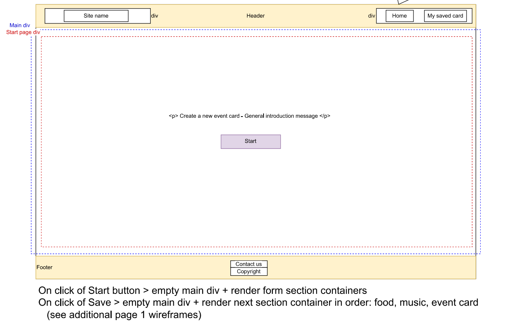

</details>

<details>
<summary>Wireframe - Form page </summary>

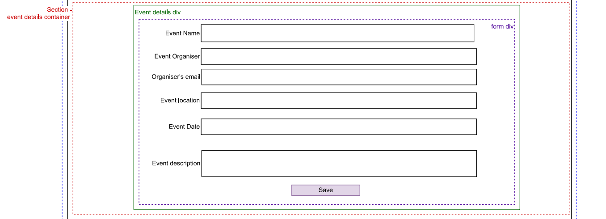

</details>

<details>
<summary>Wireframe - Food/Selection page </summary>

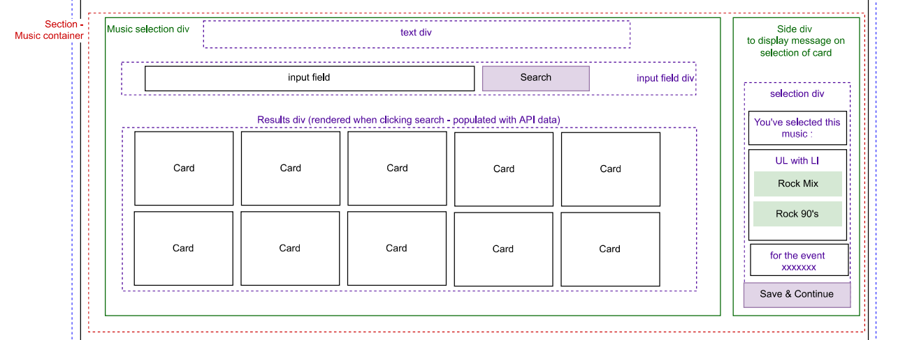

</details>

<details>
<summary>Wireframe - Event Card page </summary>

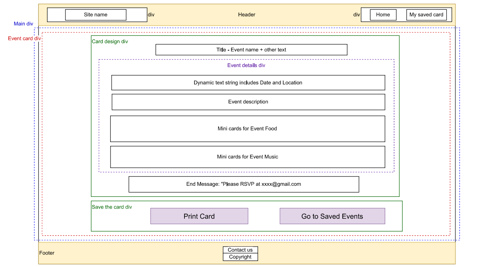

</details>

<details>
<summary>Wireframe - Saved Events page </summary>

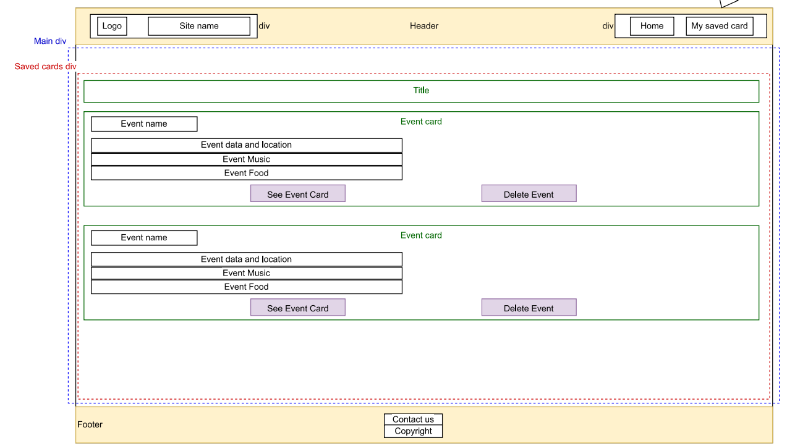

</details>

## Screenshots of the project

Desktop viewport:

<details>
<summary>Desktop - Start page </summary>


</details>

<details>
<summary>Desktop - Event details form </summary>

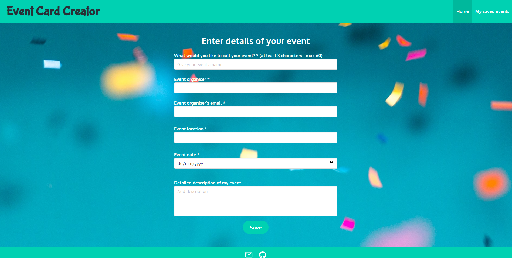

</details>

<details>
<summary>Desktop - Food selection - Empty page before first search </summary>

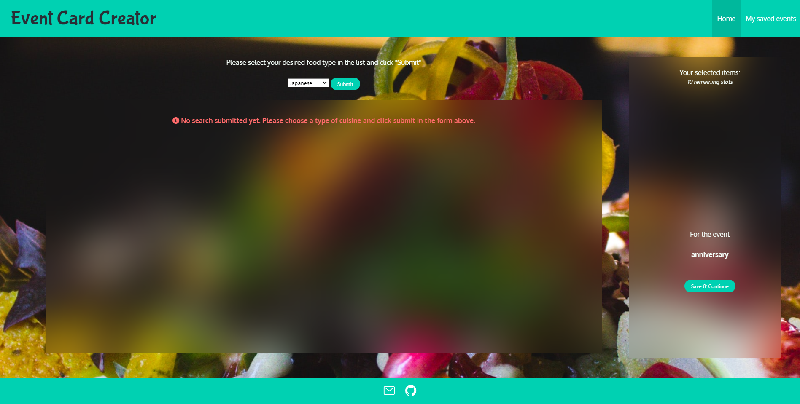

</details>

<details>
<summary>Desktop - Food selection - Search and Selection ongoing </summary>

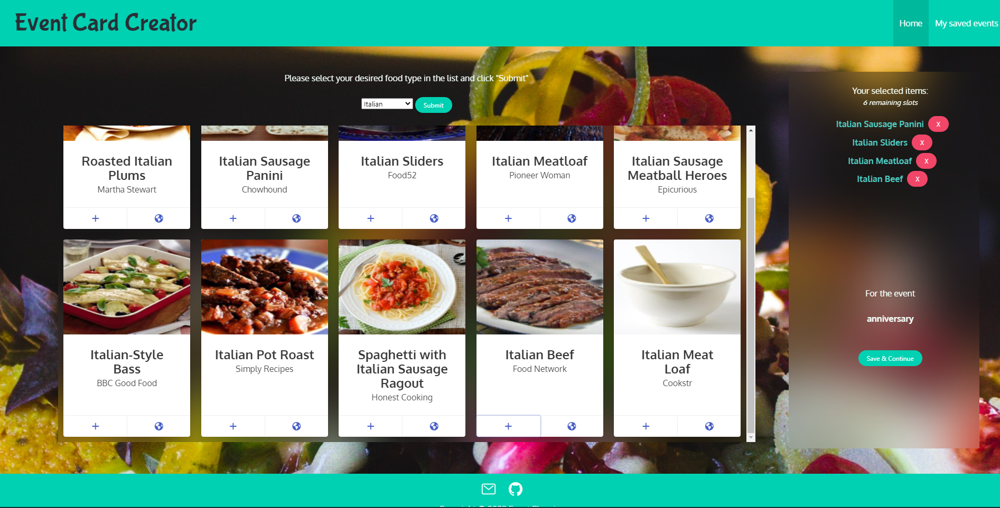

</details>

<details>
<summary>Desktop - Music selection - Empty page before first search </summary>

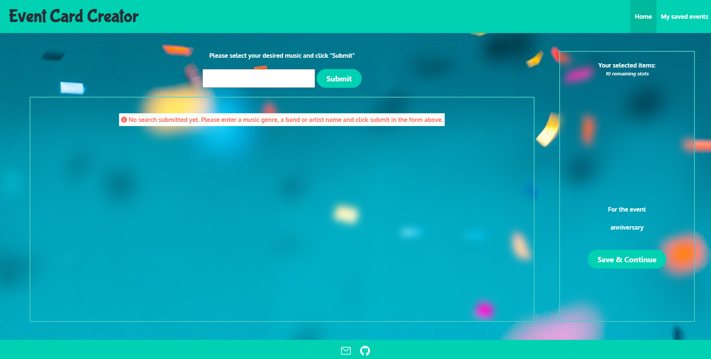

</details>

<details>
<summary>Desktop - Music selection - Search and Selection ongoing </summary>

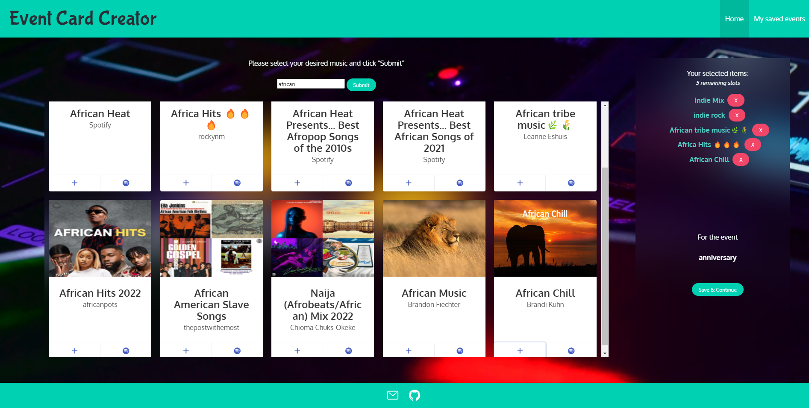

</details>

<details>
<summary>Desktop - Event card </summary>


</details>

<details>
<summary>Desktop - Saved events page </summary>

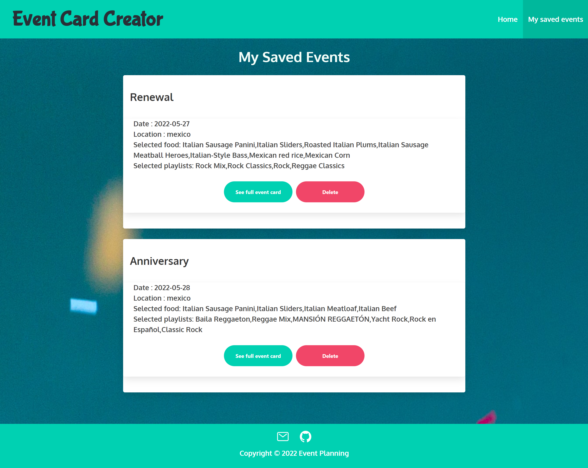

</details>

Mobile viewport:

<details>
<summary>Mobile - Start page </summary>

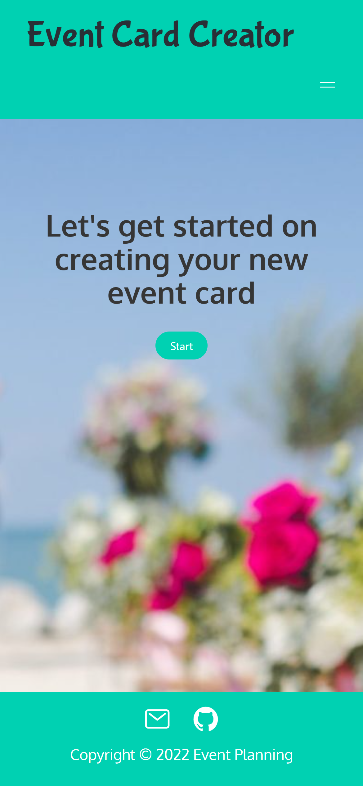

</details>

<details>
<summary>Mobile - Event details form </summary>

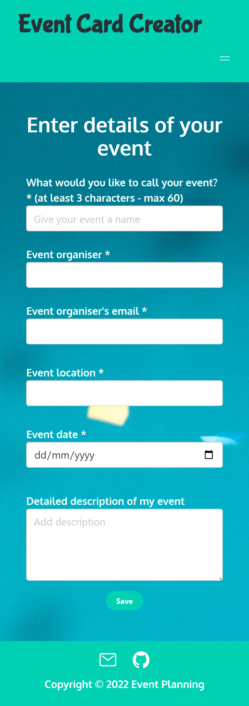

</details>

<details>
<summary>Mobile - Food/Music selection </summary>

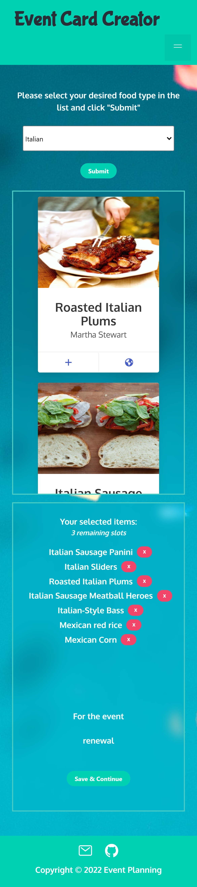

</details>

<details>
<summary>Mobile - Event card </summary>


</details>

<details>
<summary>Mobile - Saved events page </summary>

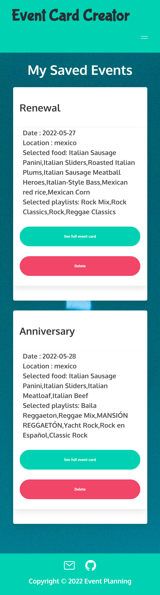

</details>

<details>
<summary>Mobile - Burger menu open </summary>

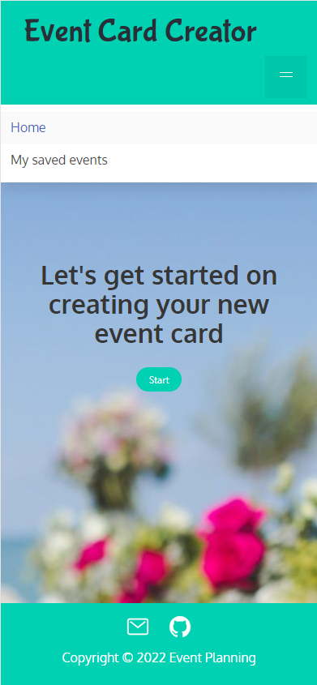

</details>

## Logic of the pages - Block diagram


## Future developments

Future improvement:

- refactor for a cleaner code 
- trigger search on select change and remove submit button
- increase the limit of items received from API
- add more options for the user to further personalise their event cards, such as being able to choose from a selection of fonts and uploading their own pictures on to their cards.

## Contact me
 
If you have any questions about this project or my work, please do get in touch by contacting me via [email](mailto:nsharmauk711@gmail.com) or find me on [LinkedIn](www.linkedin.com/in/nsharma-uk)
