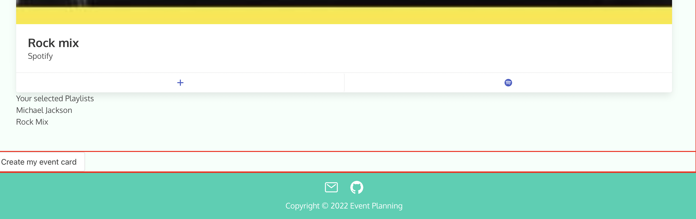
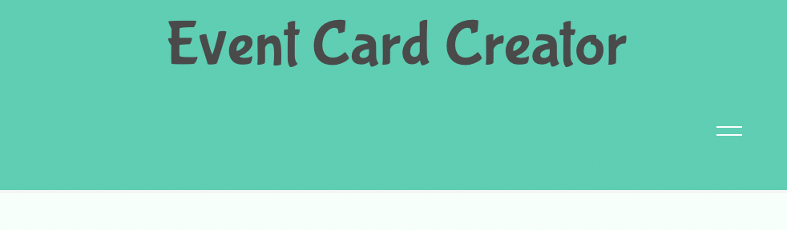
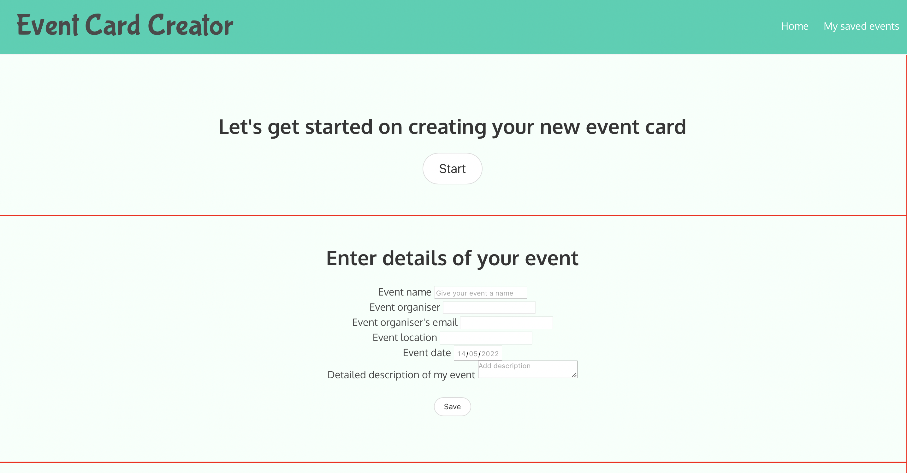
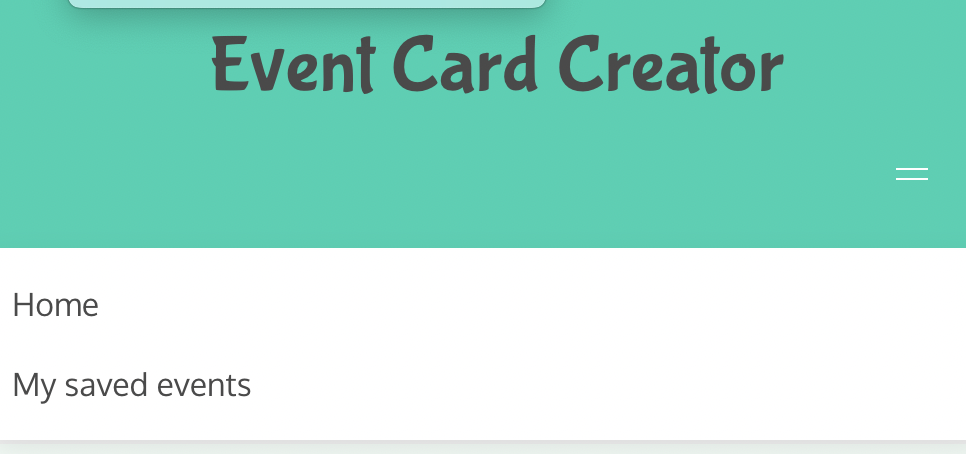

# event-planning

# Event-planning website

## Main

At the top of the webpage there is a title 'Event Card Planner'
Two tabs in the dashboard 'Home' and 'My Saved events'
the home page takes you to the home menu screen which the audience sees as the first page of the website.
the saved events card page will enable the audience to find and select their memorable events/ chosen cuisine/ music

you can also find a details section on this page which the audience can add their details and event summary which will enable the user to create an event.

Going through the pages you can find a drop down selection for the type of food you would like alternatively you can select the 'surprise me' box to have something chosen for you at random once the variables have been selected the user can move on to the next selection.

The webpage will then move to the music section. The music section has a selection drop down and selection box to type the name of the song/ singer you would like to listen to or add to your event.

Once the user has completed the dropdown form the user the select 'submit' and the event card will appear. The user can then go to saved events by selecting the 'create event card' tab in the bottom left hand corner and then in the saved tab in the drop down menu you can find and select the Event card of your choice.

There is also a copyright 2022 logo to prevent people from plagirising our idea and a link to email the company if the customer has any queries.

User story link:

## Deployed URL

You can find the application link [here](/........)

## Screenshots

